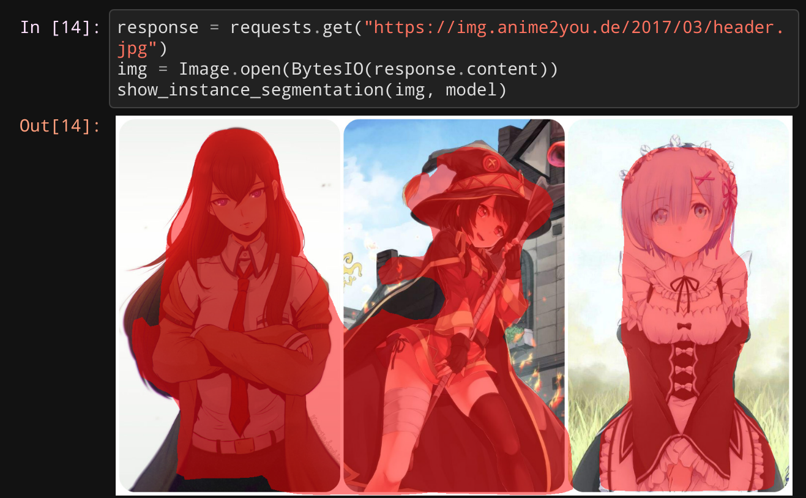

  
  <h3 align="center">Waifu Segmentation</h3>

  

    But actually anime character segmentation in general.
     
     
     
    <a href="https://github.com/Neihtq/waifu-segmentation/issues">Report Bug</a>
    ·
    <a href="https://github.com/Neihtq/waifu-segmentation/issues">Request Feature</a>
  

<!-- TABLE OF CONTENTS -->
## Table of Contents

- [Table of Contents](#table-of-contents)
- [Preface and Motivation](#preface-and-motivation)
  - [Built With](#built-with)
- [Getting Started](#getting-started)
- [Contributing](#contributing)
- [License](#license)
- [Contact](#contact)
- [Acknowledgements](#acknowledgements)

<!-- ABOUT THE PROJECT -->
## Preface and Motivation
For decades, the medium of *anime* has grown in popularity globally. It was the large development of technology - in which Japan has heavily contributed with its own innovations along with their characteristic idea - that also brought anime with in the course of globalization. Anime, in general, appears to all genders. I remember when all young boys wanted to be strong and fast like Son Goku from *Dragonball* or when young girls idolized the elegant, yet powerful and relatable (since she was a young school girl) heroine Usagi from *Sailor Moon*. At that time, the video game series *Pokémon* took over the young generations world wide. Naturally, its anime adaptation was huge success and still goes on today! Aforementioned titles are just a fraction of anime series that were popular back then in Europe, USA, etc. At the latest of 2010 til 2020, the popularity of anime in western countries sky rocketed faster and bigger than ever before. *Attack on Titans* appeals to a more mature audience, *Swort Art Online* captures the fantasies of many gamers (the gaming industry has been already huge at that time), so called shounen Jumps like *One Piece*, *Bleach* and *Naruto* that have been around for almost twenty years were approaching their climax and the latter two even met their finale. Again, the list of relevent anime shows of this decade could go on and on. What they all have in common though, are the serious topics, plots and narratives they follow, convincing characters and scenes and pictures that convey the emotions of the depicted situation so well, that also reaches the viewer. Of course, it is also thanks to the internet and its own characteristics (global exapnd, memes, social media, etc.) that helped the medium anime to get to be what it is today. In conclusion, the interest into anime and the culture around it has become less a niche.

Which brings us to a fairly recent development in otaku culture (otaku := often refers to people who are heavily into anime; also known as weeb/weeaboo which can be offensive). Remember when I mentioned that the characters became more convincing? Well it might not be entirely true for every cast in every series but I want to mention that certain characters are very popular among the otakus. Certain *types* of characters. ***Waifus***. The origin of this term goes way beyond the anime and manga. Personally, I find this quite interesting, you can read this up [here](https://www.japanpowered.com/otaku-culture/what-waifu-means). In short: young couples found the literal meaning of the chinese characters in the japanese word for Wife and Husband offensive which is why they adapted the English words *wife* and *husband*, of course with slightly different pronunciation.

So these words were slowly picked up by American otakus and used to refer to their favorite fictional characters. And the development of the meaning of *Waifu* in Otaku Culture is crazy. It matches the full spectrum of funny, wholesome, sad and scary. 

Given the that fact and the popularity of anime, I came up with the idea of *Waifu Segmentation/Detection* as a) I am currently deepening my practical experience and knowledge in Deep Learning and b) I wanted to do something *different*: No cigarette detection, no face detection, no wheat classifier, etc. That's too serious and is more likely to already exist. The task of semantic segmentation remains the same after all. So I made screenshots from various YouTube videos depicting figures that would be considered as Waifu, according to [MyWaifuList](https://mywaifulist.moe/popular), drew the segmentations masks with [LabelMe](https://github.com/wkentaro/labelme) and labelled them accordingly. Everything was done **manually** - so I also experienced the "exciting pleasure" of creating my very own custom dataset.

Contrarily the Waifu detection, I also wanted to do *Hazu Segmentation* so there is something for everyone. ***However***, unfortunately my model learned to detect anime characters in general, even though I only masks and labels of Waifus. To contraint the segmentation only to one gender might be a bit more complex and will be examined in another project.

***Tl;dr:*** Waifu and Animes has gained lots of popularity; I decied to make a Waifu segmentation; Ended up in general anime chracter segmentation.

It's not perfect (as you might have noticed from above's preview) but it does its work as expected!

### Built With
Architecture:
I finetuned a pretained [Mask R-CNN](https://arxiv.org/abs/1703.06870), which is based on top of [Faster R-CNN](https://arxiv.org/abs/1506.01497). Both are provided by [PyTorch](https://pytorch.org/)

Training and Prediction:
* [PyTorch](https://pytorch.org/): Machine learning framework
* [PyTorch Lightning](https://github.com/PyTorchLightning/pytorch-lightning): PyTorch wrapper to reduce boilerplate
* [torchvision](https://github.com/pytorch/vision.git): popular datasets and models for computer vision. Do not mistake this with the [torchvision package from pypi](https://pypi.org/project/torchvision/) as this is missing some necessary tools from the github repo!
* [NumPy](https://numpy.org/)
* [opencv-python](https://github.com/skvark/opencv-python): For working with video files
* [moviepy](https://github.com/Zulko/moviepy): For editing videos
* [Pillow (PIL fork)](https://python-pillow.org/): Image and image manipulation
* [Cython](https://cython.org/): C-Extensions for Python (necessary for coco api)
* [CocoAPI](https://github.com/cocodataset/cocoapi): For handling image annotations in [COCO](https://cocodataset.org/#home) format

Dataset preparation:
* [labelme](https://github.com/wkentaro/labelme): Tool for annotating and labelling images
* [labelme2coco](https://github.com/Tony607/labelme2coco): Converts annotations from label me to COCO format.

<!-- GETTING STARTED -->
## Getting Started
You can read through my [Jupyter Notebook](https://github.com/Neihtq/waifu-segmentation/blob/master/Segmentation.ipynb) which shows the implementation of a custom dataset class with COCO formatted annotations, finetuning the network and doing some predictions on Images and Video. I am currently working on adding some explanatory cells to provide a better understanding of the complete process.

Describing the dataset creation is still missing and I am working on that. After that I will also provide a Google Colab version where you can interactively run through the code yourself.

## Contributing

Contributions are what make the open source community such an amazing place to be learn, inspire, and create. Any contributions you make are **greatly appreciated**.

1. Fork the Project
2. Create your Feature Branch (`git checkout -b feature/AmazingFeature`)
3. Commit your Changes (`git commit -m 'Add some AmazingFeature'`)
4. Push to the Branch (`git push origin feature/AmazingFeature`)
5. Open a Pull Request

<!-- LICENSE -->
## License

Distributed under the MIT License. See `LICENSE` for more information.

<!-- CONTACT -->
## Contact
Github: [neihtq](https://github.com/Neihtq)

E-mail: q.thien.nguyen@outlook.de

[LinkedIn](https://www.linkedin.com/feed/)

## Acknowledgements
* [Best-README-Template](https://github.com/othneildrew/Best-README-Template#license)
* [How to create custom COCO data set for instance segmentation](https://www.dlology.com/blog/how-to-create-custom-coco-data-set-for-instance-segmentation/)
* [How to train an Object Detector with your own COCO dataset in PyTorch (Common Objects in Context format)](https://medium.com/fullstackai/how-to-train-an-object-detector-with-your-own-coco-dataset-in-pytorch-319e7090da5)